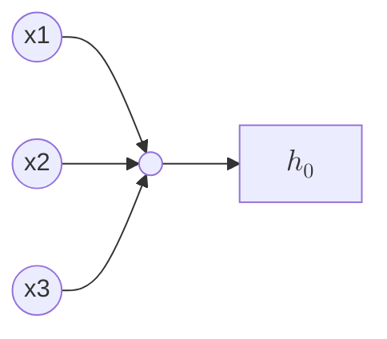

# Minimal Neural Network

> [!NOTE]
> This is derivative of [an article on X](https://x.com/konradgajdus/status/1837196363735482396) with several other sources to fill out my background.

Neural networks provide a more effective way to learn hypotheses when a model has a very large number of features, a number larger than linear or logistic regression is capable of scaling to.

At a very simple level a neuron is basically a computational unit that takes inputs from "dendrites" as electrical "spikes" which are channeled to outputs known as "axons".

In the model of a neural network, the dendrites are input features $x_1 ... x_n$ and the output is the result of an hypothesis function.

The input features and parameters are a matrix:

$$
x=\begin{bmatrix}x_{0}\\ x_{1}\\ x_{2}\\ x_{3}\end{bmatrix}
\theta=\begin{bmatrix}\theta_{0}\\ \theta_{1}\\ \theta_{2}\\ \theta_{3}\end{bmatrix}
$$

The first element ($x_0$) is known as the bias unit and is always equal to $1$.

We use the same hypothesis function as when doing classification:

$$
\frac{1}{1+e^{-\theta T_x}}
$$

## Layers
- The neural network will consist of 3 layers: input, hidden and output.
- The number of neurons in each layer is determined by the characteristics of the dataset in use.
- As we're using the MNIST dataset, and it provides handwritten digits in a 28x28 pixel format we will look to flatten each image into a single vector, and obtain an array of 784 elements that will server as our input layer.
- The output layer will comprise 10 neurons, each corresponding to one of the possible outcomes: 0-9.

### Input layer
- Accepts 28x28 pixel images flattened into a 784 dimensional vector.

### Hidden layer
- Contains 256 neurons.

### Output layer
- Contains 10 neurons, one for each class of digit.

## Processing input data
Input data is read in from IDX files downloaded from the website of [Yann LeCun](https://yann.lecun.com/exdb/mnist/)

## Weight initialization
Layers are initialized using [Kaiming He Initialization](https://paperswithcode.com/method/he-initialization).

## Forward propagation
The forward pass of input values through each layer of the neural network, applying the activation functions to produce the final output.

Forward propagation is important for the following reasons:

1. **Generates predictions** – By moving the input through the network we obtain the predicted output, which is necessary for both training and inference.
2. **Computes loss** – When training the predicted output is compared against the true labels to compute the loss, which quantifies the error.
3. **Facilitates backpropagation** – the activations and intermediate outputs computed during forward propagation are used in backpropagation to compute gradients.

### Activation functions
An activation function in a neural network defines how the weighted sum of the input is transformed into an output from one of the nodes of a layer in the network.

The activation values are the outputs from the neurons in the network after their inputs have been processed through these activation functions.  These values provide some measure of the degree to which the feature represented by the neuron is "active" in influencing the output.

This implementation uses two kinds of activation functions: ReLU and Softmax activation functions.

#### Rectified linear unit (ReLU) activation

The way ReLU works is if the input is negative or zero, then the neuron stays off (e.g. output is zero).  If the input is positive, then the neuron turns on, and gives an output equal to the input.

$$
ReLU(x) = max(0,x)
$$

#### Softmax activation
Takes a bunch of numbers and turns them into probabilities that will all add up to one.  By doing this, we can use the given scores and use them as a probability for the specific neuron being calculated.
$$
\sigma(z)_i = \frac{e^{z_i}}{\sum_{j=i}^{K}{e^{z_j}}}
$$
It works by first inflating each score exponentially (by raising $e$ to the power of the score); this ensures that all numbers are positive and growing larger numbers more than lower ones.

Next each of these new numbers are divided by the sum of all of the numbers.  This ensures that they are all now between 0 and 1, and represent probabilities.

This results in a list of probabilities that say, “If someone picks randomly based on these scores, here’s the chance they would choose each one.”

> [!NOTE]
> **Softmax activation example**

> Suppose you have a group of three friends and each one gives a score for how much they like a certain movie.

> You want to turn these scores into probabilities, showing how likely it is that each person will pick this movie as their favorite.

> Let say they give scores of 2, 1, 0 for a movie. Using Softmax you can convert those scores into probabilities like this:
> 1. Exponentials: $e^2, e^1, e^0 \approx 7.39, 2.72, 1$
> 2. Total sum: $7.39 + 2.72 + 1 = 11.11$
> 3. Probabilities: $\frac{7.39}{11.11} \approx 0.665, \frac{2.72}{11.11} \approx 0.245, \frac{1}{11.11} \approx 0.090$

>
> So, we know that the highest score of 2 has a 66.5% probability, the score of 1 a 24.5%, and the score of 0 a 9% chance of being chosen.

## References

- https://x.com/konradgajdus/status/1837196363735482396
- https://en.wikipedia.org/wiki/MNIST_database
- https://github.com/konrad-gajdus/miniMNIST-c
- https://yann.lecun.com/exdb/mnist/
- https://www.geeksforgeeks.org/kaiming-initialization-in-deep-learning/#
- https://paperswithcode.com/method/he-initialization
- https://pyimagesearch.com/2021/05/06/understanding-weight-initialization-for-neural-networks/
- https://www.deeplearning.ai/ai-notes/initialization/index.html

