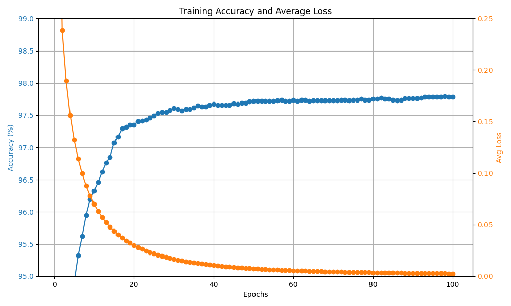

# Minimal Neural Network

> [!NOTE]
> This is derivative of [an article on X](https://x.com/konradgajdus/status/1837196363735482396) with several other sources to fill out my background.

This is an implementation of a simple neural network using only the C standard library.  It's trained with the [MNIST archive](https://yann.lecun.com/exdb/mnist/) of handwritten numbers. The trained model is saved off in a platform independent way to be used by a Python lambda that does actual predictions using a simple HTML/JS user interface.

It consists of three layers:
- **Input layer** which accepts 28x28 pixel images flattened into a 784 dimensional vector.
- **Hidden layer** containing 256 neurons.
- **Output layer** containing 10 neurons -- one for each class of digit to be predicted.

## Training

The model was trained with the dataset over 100 epochs.  Based on that, it's clear that subsequent epochs past 50 don't increase the accuracy significantly.

## Info

- Neural network implemented & trained in ANSI C.
- Plot generated using Python & Matplotlib.
- User interface implemented in Javascript/HTML/CSS.
- Prediction service implemented as a Python lambda.
- Deployment to AWS using Terraform to create & configure lambdas & API gateway.

## References

- https://x.com/konradgajdus/status/1837196363735482396
- https://github.com/konrad-gajdus/miniMNIST-c
- https://en.wikipedia.org/wiki/MNIST_database
- https://github.com/konrad-gajdus/miniMNIST-c
- https://yann.lecun.com/exdb/mnist/
- https://www.geeksforgeeks.org/kaiming-initialization-in-deep-learning/#
- https://paperswithcode.com/method/he-initialization
- https://pyimagesearch.com/2021/05/06/understanding-weight-initialization-for-neural-networks/
- https://www.deeplearning.ai/ai-notes/initialization/index.html

