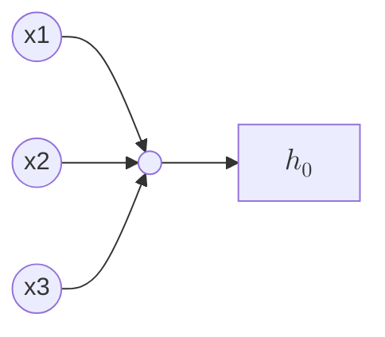

# Minimal Neural Network

> [!NOTE]
> Derived from [an article on X](https://x.com/konradgajdus/status/1837196363735482396) with several other sources to fill out my background.

Neural networks provide a more effective way to learn hypotheses when a model has a very large number of features, a number larger than linear or logistic regression is capable of scaling to.

At a very simple level a neuron is basically a computational unit that takes inputs from "dendrites" as electrical "spikes" which are channeled to outputs known as "axons".

In the model of a neural network, the dendrites are input features $x_1 ... x_n$ and the output is the result of an hypothesis function.

The input features and parameters are a matrix:

$$
x=\begin{bmatrix}x_{0}\\ x_{1}\\ x_{2}\\ x_{3}\end{bmatrix}
\theta=\begin{bmatrix}\theta_{0}\\ \theta_{1}\\ \theta_{2}\\ \theta_{3}\end{bmatrix}
$$

The first element ($x_0$) is known as the bias unit and is always equal to $1$.

We use the same hypothesis function as when doing classification:

$$
\frac{1}{1+e^{-\theta T_x}}
$$

- This is a ~200 line neural network in C using only the standard library.
- The network will be trained and tuned to recognize handwritten numerical digits from the [MNIST dataset](https://en.wikipedia.org/wiki/MNIST_database).

## Layers
- The neural network will consist of 3 layers: input, hidden and output.
- The number of neurons in each layer is determined by the characteristics of the dataset in use.
- As we're using the MNIST dataset, and it provides handwritten digits in a 28x28 pixel format we will look to flatten each image into a single vector, and obtain an array of 784 elements that will server as our input layer.
- The output layer will comprise 10 neurons, each corresponding to one of the possible outcomes: 0-9.

### Input layer
- Accepts 28x28 pixel images flattened into a 784 dimensional vector.

### Hidden layer
- Contains 256 neurons.

### Output layer
- Contains 10 neurons, one for each class of digit.

## Processing input data
Input data is read in from IDX files downloaded from the website of [Yann LeCun](https://yann.lecun.com/exdb/mnist/)

## Weight initialization
Layers are initialized using [Kaiming He Initialization](https://paperswithcode.com/method/he-initialization).

## Forward propagation

## References

- https://x.com/konradgajdus/status/1837196363735482396
- https://github.com/konrad-gajdus/miniMNIST-c
- https://yann.lecun.com/exdb/mnist/
- https://www.geeksforgeeks.org/kaiming-initialization-in-deep-learning/#
- https://paperswithcode.com/method/he-initialization
- https://pyimagesearch.com/2021/05/06/understanding-weight-initialization-for-neural-networks/
- https://www.deeplearning.ai/ai-notes/initialization/index.html
-

